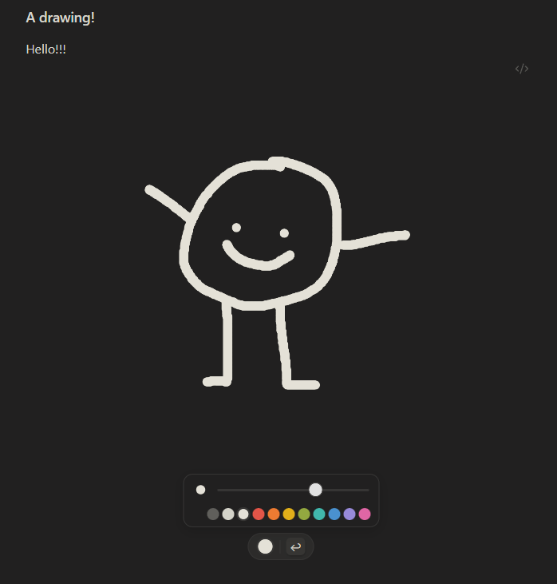

# Doodle

A cute and minimal drawing plugin for [Obsidian](https://obsidian.md).

## Usage

Enable the plugin, and add a new drawing via the command palette.
 It's a 1024x1024 bitmap canvas.

Click on the canvas to start drawing! Click outside the canvas to... stop drawing!
 Drawings are saved as PNGs in the `doodles` folder in your vault. (You can change the name in settings.)

You get some lovely colors from the [Flexoki](https://stephango.com/flexoki) palette, alongside a brush size slider.
 You also get an undo button. The world is your oyster.  